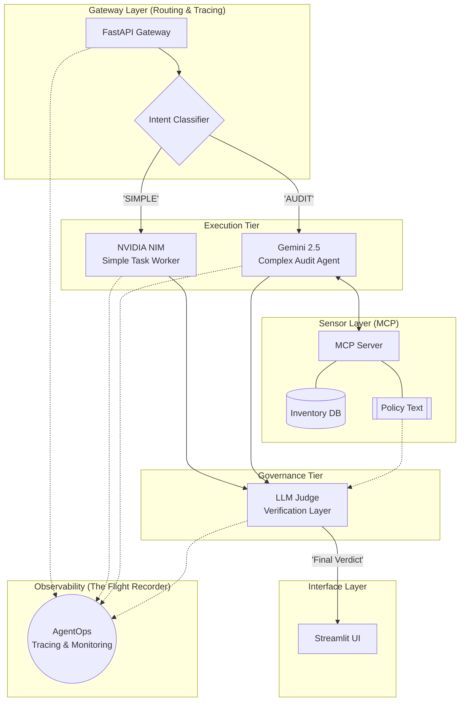

# 🛡️ Enterprise Agentic Audit Engine

An autonomous "Intelligence Plumbing" system designed to audit, verify, and remediate distributed hardware infrastructure using Agentic AI, LangGraph, and the Model Context Protocol (MCP).

## 🌟 Conceptual Overview
In an enterprise environment, hardware devices (nodes, sensors, servers) are deployed across multiple geographical sites (e.g., Kirkland, Seattle, Bellevue). Traditionally, auditing these sites for firmware compliance or hardware health is a manual, error-prone process.

**The Audit Engine** acts as a virtual **Site Reliability Auditor**. It:
1.  **Direct Observation:** Accesses live device data through a sensor layer.
2.  **Policy Reasoning:** Analyzes data against a central "Ground Truth" compliance file.
3.  **Silent Governance:** Employs a secondary "Silent Judge" to verify the Agent's reasoning before presenting it to a human.
4.  **Closing the Loop:** Proposes and executes technical remediation (e.g., firmware upgrades) with human sign-off.

---

## 🏗️ Technical Architecture

The system employs a **Hardened Gateway Pattern**, decoupling the UI from the execution logic to ensure security, rate-limiting, and scalability.

### Architecture Diagram

### 1. Gateway Pattern & Rate Limiting
Instead of exposing the AI Agent directly to the frontend, we use a **FastAPI Gateway**.
* **Security:** Centralizes authentication and log ingestion.
* **Rate Limiting:** Integrated with `SlowAPI` to prevent compute resource exhaustion (NVIDIA NIM credits) by enforcing strict request quotas per IP.

### 2. Sensor Layer: MCP Server vs. RAG
While traditional RAG (Retrieval-Augmented Generation) is suitable for static documents, it lacks the "actuator" capabilities required for infrastructure.
* **Why MCP (Model Context Protocol)?**
    * **Live Interaction:** Unlike RAG, MCP allows the agent to "talk" to live SQLite databases and file systems in real-time.
    * **Tool-Centric:** MCP transforms the database into a set of "Tools" (e.g., `get_inventory()`), allowing the agent to act rather than just search.
    * **Architecture Simplicity:** It standardizes how LLMs interact with local resources without needing custom API wrappers for every database.

### 3. Agent Structure & Human-in-the-Loop (HITL)
The "Brain" is powered by **LangGraph**, utilizing a state-machine approach.
* **Reasoning Loop:** The agent cycles through reasoning and tool calls (Sensor layer) until it reaches a conclusion.
* **The Safety Gate:** We implement a **Human-in-the-Loop** pattern. The agent can *suggest* remediation CLI commands, but the actual "Write" operation to the database requires a manual "Approve & Execute" click from a human architect.

### 4. Observability with AgentOps
Every agentic decision, tool call, and "Judge" verdict is tracked via **AgentOps**.
* **Session Replay:** Full forensic traces of every audit.
* **Compliance Trail:** A permanent record of who approved which firmware remediation and when.

---

## 🛠️ Tech Stack
- **AI Orchestration:** LangGraph, LangChain
- **Models:** NVIDIA NIM (Llama 3.1 / 3.3 / 4.0)
- **API Framework:** FastAPI, Uvicorn
- **Rate Limiting:** SlowAPI (Fixed-window)
- **Frontend:** Streamlit
- **Database:** SQLite
- **Monitoring:** AgentOps
- **Standardization:** Model Context Protocol (MCP)

---

## 🚀 Deployment (Docker)
The system is fully containerized, exposing the Gateway (Port 8000) and the UI (Port 8501).

### Build the Image
```bash
docker build -t audit-engine .